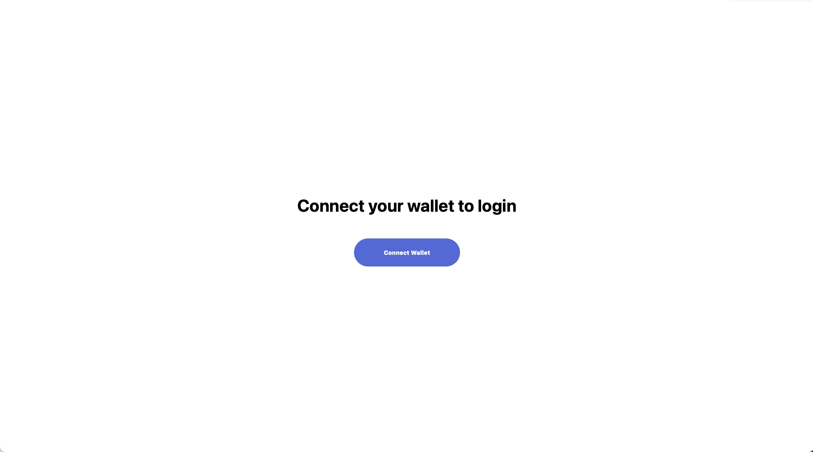
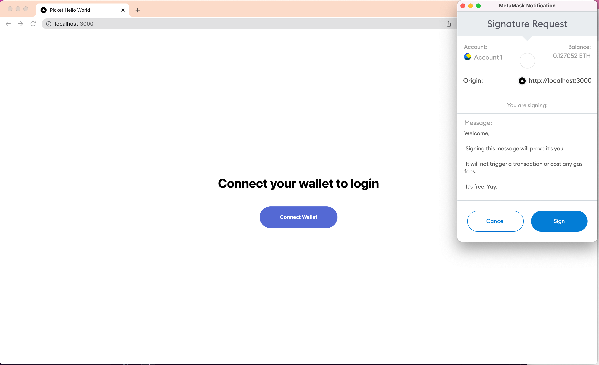

# Picket Hello World Example
For this example we’ll be using [Next.js](https://nextjs.org/). While few of the [Next.js](https://nextjs.org/) features are needed in this example tutorial, it will create a convenient launching off point for you to build on from this base. It also makes deployment easy through [Vercel](https://vercel.com/).

## 1. Create your next.js app.
In your terminal `cd` into the directory where you’d like your project folder to reside and enter the following into the terminal:
`npx create-next-app@latest —typescript`

Confirm your app is running on localhost by running
 `npm run dev`

## 2. Install the Picket React SDK 

```shell
npm install --save "@picketapi/picket-react"
```

## 3. Setup the Picket Provider 
Replace the contents of `pages/_app.tsx` with the following: 

```tsx
import "../styles/globals.css";
import type { AppProps } from "next/app";

import { PicketProvider } from "@picketapi/picket-react";

const apiKey = "YOUR_PUBLISHABLE_KEY_GOES_HERE";

function MyApp({ Component, pageProps }: AppProps) {
  return (
    <PicketProvider apiKey={apiKey}>
      <Component {...pageProps} />
    </PicketProvider>
  );
}

export default MyApp;
```

## 4. Add Your API Key
You'll need to add your pubblishable API key to make this functional. Navigate to your [Picket account dashboard](https://picketapi.com/dashboard) and copy your publishable key from a project. Now paste it into the `pages/_app.tsx`

```tsx
// in pages/_app.tsx
// Replace with your copied publishable key
const apiKey = "YOUR_PUBLISHABLE_KEY_GOES_HERE";
```

## 5. Build your home page
Copy and paste the contents of [pages/index.tsx](https://github.com/picketapi/picket-example-hello-world/blob/main/pages/index.tsx) into your local `pages/index.tsx`.

The magic method here to initiate logging in a user is `picket.login()`, which is triggered when a user click the  `Sign-In  with Your Wallet` button.

Next up, replace the contents of your local `styles/Home.module.css` with the [styles/Home.module.css](https://github.com/picketapi/picket-example-hello-world/blob/main/styles/Home.module.css).

When you navigate to http://localhost:3000 in your browser you should see the following:



## 6. Try it out!
Now, when you run `npm run dev` from the command line and navigate to http://localhost:3000 in your browser you should have a working app. You can tap on the `Sign-In with Your Wallet` button to initiate a signing request and verify your wallet.

Assuming you’re in a browser with Metamask installed, when you click on `Sign-In with Your Wallet`  you should now see the following: 



And when you click sign, you should see your wallet address you used to sign the request displayed on the page. This access token can now be used for the *lifetime of the access token* to *verify* a user’s wallet without needing to ask the user to sign another request.

This long lived strong guarantee of the user’s ownership of their wallet opens up a world of opportunities for enabling easy and secure web3 experiences. You can use it as a new one click authentication method, for limiting access to private content to certain wallet addresses, as a way to link wallets to existing user accounts and much more. 

Want to move beyond authenticating wallets and interested in how this same `picket.login()` method can be used to token gate services and verify a user has ownership of a given token? Check out the *Token Gating Tutorial*. It’s just one more step!
