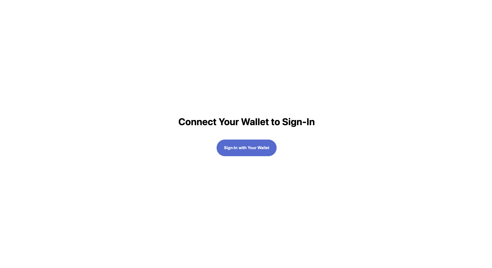

# Picket Hello World Example
For this example we’ll be using next.js. While few of the next.js features are needed in this example tutorial, it will create a convenient launching off point for you to build on from this base. It also makes deployment easy through vercel.

1. *Create your next.js app.* 
In your terminal `cd` into the directory where you’d like your project folder to reside and enter the following into the terminal:
`npx create-next-app@latest —typescript`

Confirm your app is running on localhost by running
 `npm run dev`

Now, when you navigate to `localhost:3000` in your browser you should see the following:

2. Build your home page
Replace the contents of index.tsx with the following:
```tsx
import type { NextPage } from ‘next’
import Head from ‘next/head’
import styles from ‘../styles/Home.module.css’

const Home: NextPage = () => {
  return (
    <div className={styles.container}>
      <Head>
        <title>Picket Hello World</title>
      </Head>

      <main className={styles.main}>
        <h1 className={styles.title}>
          Connect your wallet to login
        </h1>
        <button className={styles.connectWalletButton}>Connect Wallet</button>
      </main>
    </div>
  )
}

export default Home
```

Replace the contents of Home.module.css with the following:
```css
.container {
  padding: 0 2rem;
}

.main {
  min-height: 100vh;
  padding: 4rem 0;
  flex: 1;
  display: flex;
  flex-direction: column;
  justify-content: center;
  align-items: center;
}

.title {
  color: black;
  padding-bottom: 20px;
}

.connectWalletButton{
  border-style: none;
  background-color: #5469d4;
  width: 200px;
  padding: 20px;
  border-radius: 50px;

  color: white;
  font-weight: 800;
}

```

When you navigate to localhost:3000 in your browser you should see the following:



3. Install Picket
Now on to the juicy stuff. Let’s make the connect wallet button functional. First thing to do is to install the picket-js library. In your terminal, from within your project directory first make sure you are no longer running your local server by typing `ctrl + c` if you haven’t already.  Then type the following into your terminal: 
`npm install --save @picketapi/picket-js`

4. Set up the Picket Library in your project
Once picket is successfully installed you can import it within your `index.tsx` file by putting the following import statement at the top of your `index.tsx` file and creating a picket object with your api key that you can get from the *dashboard*:

```js
import Picket from "@picketapi/picket-js";
const picket = new Picket("your-api-key-goes-here")
```

5. Set up the “connect wallet” button to log in the user with picket

Now that you have the picket library installed, the magic method to verify a users’ wallet is the following: 
```tsx
await picket.login()
```

Let’s wrap that method in a function you can call from the “Connect Wallet” button. Still within index.ts, place the following within the function for the `NextPage` titled `Home`, above the return statement.
```tsx
const onLogin = async () => {
    try {
      const loginObject = await picket.login();
      //Do whatever you'd like to do after a successful login
      alert(loginObject.user.walletAddress + " successfully logged in. \n\nThe following access token can be used to secure future requests:\n\n" + loginObject.accessToken)
    } catch (err) {
      console.error(err);
    }
  };

```

And then within the html declaration of the “Connect Wallet” button, update it with an onclick event that calls the above method like so: 
```html
<button className={styles.connectWalletButton} onClick={onLogin}>Connect Wallet</button>
```

After this, your index.tsx file should look like this:
```tsx
import type { NextPage } from ‘next’
import Head from ‘next/head’
import styles from ‘../styles/Home.module.css’

import Picket from “@picketapi/picket-js”;
const apiKey = “pk-your-key-goes-here”
const picket = new Picket(apiKey)

const Home: NextPage = () => {

  const onLogin = async () => {
    try {
      const loginObject = await picket.login();
      ///Do whatever you’d like to do after a successful login/
      alert(loginObject.user.walletAddress + “ successfully logged in. \n\nThe following access token can be used to secure future requests:\n\n” + loginObject.accessToken)
    } catch (err) {
		//Error case
      console.error(err);
    }
  };
  
  return (
    <div className={styles.container}>
      <Head>
        <title>Picket Hello World</title>
        <meta name=“description” content=“Saying hello to a web3 world” />
        <link rel=“icon” href=“/favicon.ico” />
      </Head>

      <main className={styles.main}>
        <h1 className={styles.title}>
          Connect your wallet to login
        </h1>
        <button className={styles.connectWalletButton} onClick={onLogin}>Connect Wallet</button>
      </main>
    </div>
  )
}

export default Home
```

6. Try it out!
Now, when you run `npm run dev` from the command line and navigate to `localhost:3000` in your browser you should have a working app that lets you tap on the “Connect Wallet” button to initiate a signing request and verify your wallet.

Assuming you’re in a browser with Metamask installed, when you click on “Connect Wallet” you should now see the following: 


And when you click sign, you should see an alert that displays your wallet address you used to sign the request as well as an access token. The wallet address and access token are returned by the `picket.login()` method. This access token can now be used for the *lifetime of the access token* to *verify* a user’s wallet without needing to ask the user to sign another request.

This long lived strong guarantee of the user’s ownership of their wallet opens up a world of opportunities for enabling easy and secure web3 experiences. You can use it as a new one click authentication method, for limiting access to private content to certain wallet addresses, as a way to link wallets to existing user accounts and much more. Want to move beyond authenticating wallets and interested in how this same picket.login() method can be used to token gate services and verify a user has ownership of a given token? Check out the *Token Gating Tutorial*. It’s just one more step!